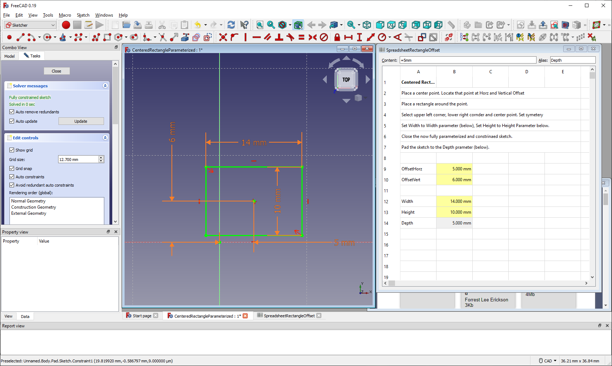

# FreeCAD-CenteredRectangleParameterized  
A FreeCAD Example Drawing of and Offset Centered Rectangle Parameterized for Width, Height, and Depth

<a
href="ConstrainedRectangleSolid.png">  
Screen shot of FreeCAD environment with finished body.
</a>  
Note the spread sheet which parameterized the body.

<a
href="ConstrainedSketch.png">  
Screen shot of FreeCAD ketch showing the constrained offset width and height rectangle.
</a>

Instructions for use is in the spread sheet. See rows 2 through 7.
 
